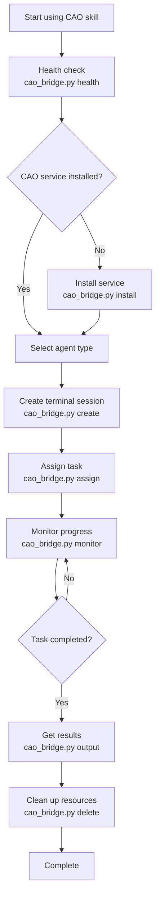

# CAO (CLI Agent Orchestrator) Skill

[](https://opensource.org/licenses/MIT)
[](https://claude.ai/code)

**CAO** is a professional CLI Agent Orchestrator skill that provides powerful multi-agent orchestration and automated task management capabilities for Claude Code.

## ✨ Features

- 🎯 **Separated Command Design** - Health check and installation are completely separated, giving users full control over installation timing
- 🚀 **Smart Auto Installation** - Zero-configuration CAO service installation based on uvx
- 🤖 **Multi-Agent Collaboration** - Supports three agent types: developer, code-reviewer, researcher
- 🔌 **Multi-Provider Support** - Compatible with droid, claude_code, codex, q_cli, kiro_cli
- 📊 **Real-time Monitoring** - Task execution status monitoring and progress tracking
- 📬 **Inbox Messaging** - Inter-agent communication and status synchronization
- 🛠️ **Zero Configuration** - Out-of-the-box user experience

## 🚀 Quick Start

### Install Skill

#### Option 1: OpenSkills (Recommended for Developers)
```bash
# Install to current project
openskills install https://github.com/yubing744/cao-skill.git

# Install globally
openskills install --global https://github.com/yubing744/cao-skill.git

# Install to universal directory (recommended)
openskills install --universal https://github.com/yubing744/cao-skill.git
```

#### Option 2: Claude Code Marketplace
Search for "CAO" or "CLI Agent Orchestrator" in Claude Code skill marketplace

#### Option 3: Manual Install
```bash
# Clone skill to local
git clone https://github.com/yubing744/cao-skill.git ~/.claude/skills/cao
```

### Basic Usage

```bash
cd ~/.claude/skills/cao

# Health check
python3 scripts/cao_bridge.py health

# Assign task to developer agent
python3 scripts/cao_bridge.py assign developer "Implement a new REST API endpoint"

# Monitor task status
python3 scripts/cao_bridge.py monitor <terminal_id>

# List all terminals
python3 scripts/cao_bridge.py list
```

## 📖 Detailed Documentation

- [📋 Installation Guide](INSTALL.md) - Complete installation and configuration instructions
- [🔧 Usage Guide](SKILL.md) - Detailed feature introduction and 48 practical examples
- [📢 Publishing Information](PUBLISHING.md) - Skill release status and version information

## 🎯 Supported Commands

| Command | Description | Example |
|---------|-------------|---------|
| `health` | Check CAO service status | `python3 scripts/cao_bridge.py health` |
| `install` | Install CAO service | `python3 scripts/cao_bridge.py install` |
| `list` | List all terminals | `python3 scripts/cao_bridge.py list` |
| `create` | Create new terminal | `python3 scripts/cao_bridge.py create q_cli developer` |
| `assign` | Assign task | `python3 scripts/cao_bridge.py assign developer "Task description"` |
| `monitor` | Monitor terminal | `python3 scripts/cao_bridge.py monitor <terminal_id>` |
| `terminal` | Terminal interaction | `python3 scripts/cao_bridge.py terminal <terminal_id> "command"` |
| `output` | Get output | `python3 scripts/cao_bridge.py output <terminal_id>` |
| `delete` | Delete terminal | `python3 scripts/cao_bridge.py delete <terminal_id>` |
| `inbox-list` | View messages | `python3 scripts/cao_bridge.py inbox-list` |
| `inbox-send` | Send message | `python3 scripts/cao_bridge.py inbox-send "Message content"` |

## 🏗️ Workflow



## 🤖 Supported Agent Types

### Developer Agent
- **Function**: Software development and programming tasks
- **Use cases**: Code implementation, feature development, bug fixing
- **Provider**: q_cli, kiro_cli, open_autoglm

### Code-Reviewer Agent
- **Function**: Code review and quality assessment
- **Use cases**: Code review, quality checking, best practice verification
- **Provider**: claude_code, codex

### Researcher Agent
- **Function**: Research analysis and information gathering
- **Use cases**: Technical research, documentation analysis, problem investigation
- **Provider**: claude_code, codex

## 🔌 Technical Architecture

- **Language**: Python 3.8+
- **Core Dependency**: uvx (Python tool executor)
- **Terminal Management**: tmux session management
- **Process Management**: Background task monitoring
- **Message Passing**: Inbox system

## 📊 Project Statistics

| Item | Count |
|------|-------|
| Files | 5 core files |
| Lines of Code | ~25,000 lines |
| Commands | 12 main commands |
| Agent Types | 3 professional types |
| Provider Types | 5 compatible providers |
| Documentation Examples | 48 practical examples |
| Flowcharts | 3 Mermaid diagrams |

## 🤝 Contributing

Issues and Pull Requests are welcome!

1. Fork the project
2. Create feature branch (`git checkout -b feature/AmazingFeature`)
3. Commit changes (`git commit -m 'Add some AmazingFeature'`)
4. Push to branch (`git push origin feature/AmazingFeature`)
5. Open a Pull Request

## 📄 License

This project is licensed under the MIT License - see the [LICENSE](LICENSE) file for details.

## 🔗 Related Links

- **GitHub Repository**: https://github.com/yubing744/cao-skill
- **Claude Code**: https://claude.ai/code
- **Issues**: https://github.com/yubing744/cao-skill/issues
- **Wiki**: https://github.com/yubing744/cao-skill/wiki

## 📈 Changelog

### v2.1.0 (2025-12-16)
- ✅ Implemented separated command design
- ✅ Added auto installation functionality
- ✅ Optimized skill-relative path support
- ✅ Improved documentation and examples
- ✅ Prepared skill marketplace release

---

<div align="center">
  <strong>Making agent orchestration simple and powerful! 🚀</strong>
</div>