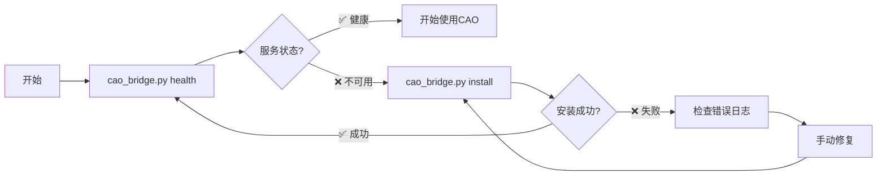
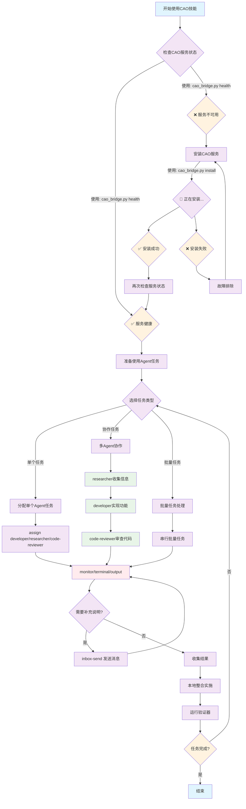
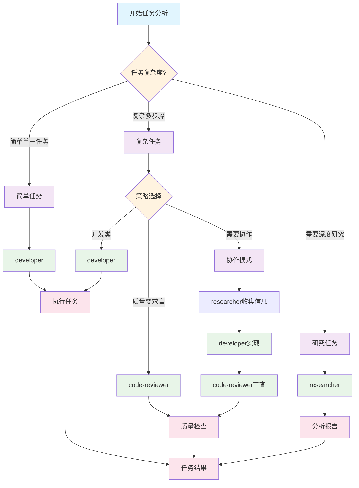

# CAO 专业技能

CAO (CLI Agent Orchestrator) 是一个强大的Agent编排系统，可以管理多个AI Agent执行复杂的开发任务。这个技能提供了标准化的CAO使用流程和最佳实践。

## 🚀 快速开始

> 约定：所有CAO相关操作统一使用本技能自带的CLI脚本 `scripts/cao_bridge.py` 执行。

### 📍 技能安装位置

本技能支持多种安装方式：

#### 方式一：Claude Code 技能市场安装（推荐）
```bash
# 在 Claude Code 中通过技能管理器安装
# 安装后技能位于：~/.claude/skills/cao/
```

#### 方式二：OpenSkills 安装（推荐开发者）
```bash
# 安装到当前项目
openskills install https://github.com/yubing744/cao-skill.git

# 安装到全局环境
openskills install --global https://github.com/yubing744/cao-skill.git

# 安装到通用目录（推荐）
openskills install --universal https://github.com/yubing744/cao-skill.git
```

#### 方式三：手动安装
```bash
# 克隆到 Claude Code 技能目录
git clone https://github.com/yubing744/cao-skill.git ~/.claude/skills/cao
```

### 🎯 使用方法

#### 从技能目录内使用（推荐）
```bash
# 进入技能目录
cd ~/.claude/skills/cao

# 运行命令
python3 scripts/cao_bridge.py health
```

#### 从项目目录内使用
```bash
# 假设项目根目录包含 .claude/skills/cao/
python3 .claude/skills/cao/scripts/cao_bridge.py health
```

#### 从任意位置使用（设置PATH）
```bash
# 添加到PATH（可选）
export PATH="$HOME/.claude/skills/cao/scripts:$PATH"

# 然后直接使用
cao_bridge.py health
```

### 环境检查

> ⚠️ **重要**：以下命令假设您已经进入技能目录（`cd ~/.claude/skills/cao`）

```bash
# 1. 检查CAO API状态
python3 scripts/cao_bridge.py health

# 2. 安装CAO服务（如果需要）
python3 scripts/cao_bridge.py install

# 3. 验证GitHub CLI
gh auth status

# 4. 检查Python环境
python3 --version

# 5. 检查依赖（requests, uvx）
python3 -c "import requests; print(requests.__version__)"
uvx --version
```

### 🚀 一键启动命令

如果您在其他目录，可以使用以下任一方式：

```bash
# 方式1：完整路径
python3 ~/.claude/skills/cao/scripts/cao_bridge.py health

# 方式2：设置别名（推荐）
alias cao="python3 ~/.claude/skills/cao/scripts/cao_bridge.py"
cao health

# 方式3：进入技能目录
cd ~/.claude/skills/cao
python3 scripts/cao_bridge.py health
```

### 🆕 分离式安装和检查



```bash
# 推荐工作流：
# 1. 先检查状态：python3 cao_bridge.py health
# 2. 如需要则安装：python3 cao_bridge.py install
# 3. 再次检查：python3 cao_bridge.py health

# 仅检查服务状态
python3 scripts/cao_bridge.py health

# 安装CAO服务（自动处理依赖和配置）
python3 scripts/cao_bridge.py install
```

### 创建第一个Agent任务
```bash
# 简单任务分配（从repo根目录执行）
python3 scripts/cao_bridge.py assign developer \
  --timeout 1800 <<'EOF'
🎯 任务：分析项目代码质量

📋 执行要求：
1. 快速扫一遍目录结构
2. 找出明显的坏味道/重复代码/缺测试区域
3. 给出Top 5可落地改进建议

📊 输出格式：
=== 代码质量快速报告 ===
EOF
```

## 🧭 CAO技能工作流程图



### 🔄 标准工作流程（对应 `/workflow:understand`）

1. **环境检查阶段**：
   - 使用 `cao_bridge.py health` 检查服务状态
   - 如需要，使用 `cao_bridge.py install` 安装CAO服务
   - 确认服务健康后进入任务准备阶段

2. **任务规划阶段**：
   - 使用 `/workflow:understand` 进行上下文理解（读取Memory Bank → 拆解任务 → 明确输出）
   - 根据任务复杂度选择执行模式（单个/协作/批量）

3. **任务执行阶段**：
   - 用 `cao_bridge.py assign` 将任务派发到合适的 `agent_profile` / `provider`
   - 用 `cao_bridge.py monitor` / `terminal` / `output` 监控执行状态

4. **协作调整阶段**：
   - 必要时用 `cao_bridge.py inbox-send` 给对应terminal发补充要求
   - 基于反馈调整任务执行策略

5. **结果整合阶段**：
   - 将Agent输出转化为代码/变更
   - 运行仓库的validators进行质量检查
   - 如需要返回任务规划阶段进行调整

## 📋 核心功能

### 1. Agent Profiles（Agent类型）

#### `developer` - 开发专家
- **适用任务**: 代码开发、bug修复、功能实现
- **技能**: GitHub CLI、多语言编程、调试测试
- **支持Providers**: droid, claude_code, codex, q_cli, kiro_cli
- **典型场景**: trading-gpt项目issue修复、代码重构

#### `code-reviewer` - 代码审查专家
- **适用任务**: PR审查、代码质量分析、安全检查
- **技能**: 深度代码分析、架构评估、最佳实践验证
- **支持Providers**: droid, claude_code, codex, q_cli, kiro_cli
- **典型场景**: Rooch Network PR审查、安全漏洞检测

#### `researcher` - 技术研究专家
- **适用任务**: 技术调研、文档分析、竞品研究
- **技能**: 文献检索、数据分析、报告生成
- **支持Providers**: droid, claude_code, codex, q_cli, kiro_cli
- **典型场景**: 开源项目调研、技术趋势分析

### 2. 任务管理

#### 标准任务模板
```
🎯 任务：[具体任务名称]

📋 执行要求：
1. [具体步骤1]
2. [具体步骤2]
3. [具体步骤3]

📊 输出格式：
```
[期望的输出格式]
```

⏰ 预期时间：[预计完成时间]
🎯 成功标准：[明确的完成标准]
```

#### 任务优先级指南
- **🔴 高优先级**: 安全漏洞、关键bug、阻塞性问题
- **🟡 中优先级**: 功能开发、代码重构、性能优化
- **🟢 低优先级**: 文档更新、调研分析、工具改进

### 3. 进度监控

#### 检查Agent状态
```bash
python3 scripts/cao_bridge.py terminal <terminal_id>
```

#### 实时输出监控
```bash
python3 scripts/cao_bridge.py monitor <terminal_id>
```

#### 🆕 Inbox消息监控
```bash
# 拉取消息
python3 scripts/cao_bridge.py inbox-list <terminal_id> \
  --status pending --limit 20

# 发送消息
python3 scripts/cao_bridge.py inbox-send \
  <receiver_id> <sender_id> "请补充：给出复现步骤和最小化diff" 
```

## 🛠️ 高级功能

### 1. 批量任务处理
```bash
# 串行批量：简单、可控、便于逐步收敛
python3 scripts/cao_bridge.py assign developer --timeout 3600 <<'EOF'
🔧 任务：修复bug #1
EOF

python3 scripts/cao_bridge.py assign code-reviewer --timeout 3600 <<'EOF'
🔍 任务：审查PR #123
EOF

python3 scripts/cao_bridge.py assign researcher --timeout 3600 <<'EOF'
📚 任务：调研新技术X
EOF
```

#### 🆕 Provider选择任务处理
```bash
# 使用Codex provider处理“代码生成/重构类”任务
python3 scripts/cao_bridge.py assign developer \
  --provider codex --timeout 3600 <<'EOF'
🎯 任务：重构一段代码
请使用现代Python最佳实践重构目标代码，并补充必要测试。
EOF

# 使用Kiro CLI provider处理“系统/DevOps类”任务
python3 scripts/cao_bridge.py assign developer \
  --provider kiro_cli --timeout 3600 <<'EOF'
🎯 任务：系统部署/DevOps
请输出可执行的部署步骤（含回滚策略），并说明验证方式。
EOF
```

### 2. Agent协作模式
```bash
# 协作模式建议：researcher → developer → code-reviewer

# 1) researcher：收集信息
python3 scripts/cao_bridge.py assign researcher \
  --timeout 1800 <<'EOF'
📚 任务：收集项目X的技术文档和API信息
输出：结构化要点 + 关键链接/文件路径 + 风险点。
EOF

# 2) developer：基于research输出实现
# 提示：上一步 `assign` 会把输出保存到当前目录的 `task_output_<terminal_id>.txt`，可复制粘贴关键部分到下一步任务中。
python3 scripts/cao_bridge.py assign developer \
  --timeout 3600 <<'EOF'
🚀 任务：基于research结果实现功能
要求：给出实现方案、关键代码变更点、以及需要补充的测试列表。
EOF

# 3) code-reviewer：审查实现
python3 scripts/cao_bridge.py assign code-reviewer \
  --timeout 3600 <<'EOF'
🔍 任务：对上一步实现进行审查
重点：正确性/安全性/可维护性/测试覆盖。
EOF
```

### 3. 长时间任务处理
```bash
python3 scripts/cao_bridge.py assign researcher \
  --timeout 14400 <<'EOF'
📚 任务：全面代码库分析
1. 扫描关键模块
2. 识别技术债务与高风险点
3. 分析架构模式与依赖关系
4. 输出Top 10改进建议（按ROI排序）

请在输出中标注：时间估算/风险/验证方式。
EOF
```

#### 🆕 增强的Agent协作模式
```bash
# 1) researcher（偏复杂推理）
python3 scripts/cao_bridge.py assign researcher \
  --provider claude_code --session-name research-phase --timeout 1800 <<'EOF'
📚 任务：收集和分析项目技术栈信息
输出：架构图（文字描述即可）+ 关键模块 + 风险点。
EOF

# 2) developer（偏代码生成/实现）
python3 scripts/cao_bridge.py assign developer \
  --provider codex --session-name development-phase --timeout 3600 <<'EOF'
🚀 任务：基于research结果实现功能
要求：最佳实践实现 + 必要测试 + 说明验证方式。
EOF

# 3) 如果需要中途补充要求（消息系统）
python3 scripts/cao_bridge.py inbox-send \
  <developer_terminal_id> <researcher_terminal_id> "请重点关注性能优化与错误处理，并给出回滚方案"
```

## 📊 实用场景

### 场景1：开源项目贡献流程
```bash
# 1) researcher：分析issues
python3 scripts/cao_bridge.py assign researcher \
  --timeout 1800 <<'EOF'
📚 任务：分析项目的open issues，识别高价值贡献机会
输出：推荐的3-5个issue（含难度/影响/预估时间/风险）。
EOF

# 2) developer：实现修复
python3 scripts/cao_bridge.py assign developer \
  --timeout 7200 <<'EOF'
🔧 任务：选择一个issue并实现修复
要求：
1) 给出根因分析
2) 提交最小化修复
3) 补充/更新测试
4) 给出验证步骤
EOF

# 3) code-reviewer：审查实现
python3 scripts/cao_bridge.py assign code-reviewer \
  --timeout 3600 <<'EOF'
🔍 任务：审查上一步实现
重点：正确性/回归风险/安全性/测试覆盖。
EOF

# 4) developer：创建PR（如果环境允许）
python3 scripts/cao_bridge.py assign developer \
  --timeout 3600 <<'EOF'
🚀 任务：根据review建议完善并创建PR
要求：PR描述包含：背景、根因、修复点、测试方式、风险评估。
EOF
```

#### 🆕 增强的开源贡献流程（使用新功能）
```bash
# 选择provider的一般策略：
# - researcher + claude_code：偏分析/归纳
# - developer + codex：偏代码生成/重构
# - code-reviewer + droid/claude_code：偏审查/风险识别

python3 scripts/cao_bridge.py assign researcher \
  --provider claude_code --session-name issue-analysis --timeout 1200 <<'EOF'
📚 任务：分析项目open issues，推荐3-5个最值得做的
要求：难度/影响/预估工作量/依赖上下文。
EOF

python3 scripts/cao_bridge.py assign developer \
  --provider codex --session-name implementation --timeout 7200 <<'EOF'
🔧 任务：选择一个issue并实现修复
要求：测试齐全、向后兼容、提交最小diff。
EOF

# 如需补充指导，用inbox消息快速对齐
python3 scripts/cao_bridge.py inbox-send \
  <developer_terminal_id> <researcher_terminal_id> "请先复现问题并给出最小复现；修复必须含单测"

python3 scripts/cao_bridge.py assign code-reviewer \
  --provider droid --session-name quality-review --timeout 1800 <<'EOF'
🔍 任务：对修复进行质量审查
重点：正确性/测试/安全/性能影响。
EOF
```

### 场景2：技术债务清理
```bash
python3 scripts/cao_bridge.py assign developer \
  --timeout 7200 <<'EOF'
🧹 任务：技术债务清理计划
1) 识别Top 10技术债务（按影响排序）
2) 给出重构优先级、风险与回滚方案
3) 给出分阶段实施时间线

输出：=== 技术债务清理计划 ===（含清单、估时、风险、验证方式）
EOF
```

### 场景3：安全审查
```bash
python3 scripts/cao_bridge.py assign code-reviewer \
  --timeout 5400 <<'EOF'
🔐 任务：全面安全审查
1) 输入校验/注入风险
2) 认证授权
3) 敏感信息与日志
4) 依赖与供应链风险

输出格式：
=== 安全审查报告 ===
按高/中/低风险分级，并给出可执行修复建议。
EOF
```

### 🆕 场景4：Upstream Provider集成实战（基于Open-AutoGLM经验）
```bash
# 基于Open-AutoGLM集成的实战经验总结

# 1) researcher：分析集成需求和架构
python3 scripts/cao_bridge.py assign researcher \
  --timeout 1800 <<'EOF'
📚 任务：分析Open-AutoGLM作为CAO provider的集成需求
要求：
1. 研究Open-AutoGLM的架构和接口特性
2. 分析现有CAO provider模式和BaseProvider抽象类
3. 识别需要实现的核心接口方法
4. 评估集成复杂度和技术风险
5. 确定与现有providers的差异化定位

输出：=== Open-AutoGLM集成分析报告 ===
包含：架构分析、接口设计、实现策略、风险评估
EOF

# 2) developer：实现provider并确保upstream兼容性
python3 scripts/cao_bridge.py assign developer \
  --provider droid --timeout 3600 <<'EOF'
🚀 任务：实现OpenAutoGLMProvider并确保upstream兼容
要求：
1. 继承BaseProvider抽象类，实现所有必需方法
2. 核心方法：initialize(), get_status(), extract_last_message_from_script()等
3. 更新ProviderType枚举和ProviderManager
4. 创建完整测试套件验证功能
5. ⚠️ 关键：仅包含OpenAutoGLM相关代码，不添加其他未合并的provider

🔴 Upstream兼容性要求：
- 基于upstream/main最新代码开发
- 不包含本地实验性代码（如codex provider）
- 代码风格符合upstream规范
- 测试在upstream环境中可运行
EOF

# 3) code-reviewer：验证upstream PR质量
python3 scripts/cao_bridge.py assign code-reviewer \
  --timeout 1800 <<'EOF'
🔍 任务：全面验证upstream PR质量
检查项：
1. 确认基于upstream/main且无本地未合并代码
2. 代码风格和结构符合upstream标准
3. 测试覆盖完整且在upstream环境通过
4. PR描述清晰，包含背景、实现、测试说明
5. 无多余文件或配置污染

📊 输出格式：
=== Upstream PR质量检查报告 ===
✅/❌ 检查项状态 + 问题清单 + 修复建议
EOF

# 🎯 实战经验总结：
# ✅ 成功做法：
# - 使用CAO技能自动化整个开发流程
# - 严格基于upstream分支开发
# - 及时清理未合并的本地代码
# - 分阶段验证：功能测试 → upstream兼容性检查 → PR质量审查

# ❌ 避免的坑：
# - 不要在本地test分支开发upstream功能
# - 不要包含未合并到upstream的本地代码
# - 不要忽视upstream的代码规范和PR要求
```

## 🔧 故障排除

### 常见问题

#### 1. Agent无响应
```bash
# 检查CAO服务状态（推荐）
python3 scripts/cao_bridge.py health

# 重启CAO服务
pkill -f cao-server
# 重新启动CAO服务
```

#### 2. 任务超时
```bash
# 增加超时时间
python3 scripts/cao_bridge.py assign developer --timeout 3600 <<'EOF'
🎯 任务：...
EOF

# 或者把大任务拆成多个小任务，逐个assign
python3 scripts/cao_bridge.py assign developer --timeout 1200 <<'EOF'
子任务1：...
EOF
python3 scripts/cao_bridge.py assign developer --timeout 1200 <<'EOF'
子任务2：...
EOF
```

#### 3. 内存使用过高
```bash
# 先列出sessions/terminals，手工选择需要清理的terminal_id
python3 scripts/cao_bridge.py list

# 然后删除
python3 scripts/cao_bridge.py delete <terminal_id>
```

## 📈 性能优化

### 1. 并发任务处理
```bash
# 并发（shell级）：注意并发会增加本机与CAO的资源压力
python3 scripts/cao_bridge.py assign developer --timeout 1800 <<'EOF' &
任务1：...
EOF

python3 scripts/cao_bridge.py assign code-reviewer --timeout 1800 <<'EOF' &
任务2：...
EOF

python3 scripts/cao_bridge.py assign researcher --timeout 1800 <<'EOF' &
任务3：...
EOF

wait
```

### 2. 任务队列管理
建议：优先用“串行批量 + 明确的拆分与验收标准”来实现队列效果；需要更复杂调度时再单独实现调度器脚本。

## 🎯 最佳实践

### 1. 任务设计原则
- **明确性**: 任务描述要具体、可执行
- **可测量**: 定义明确的成功标准
- **可分解**: 大任务分解为小步骤
- **时间限制**: 设置合理的超时时间

### 2. Agent选择指南



**快速选择指南**：
- **简单任务**: 优先使用developer
- **质量要求高**: 使用code-reviewer
- **研究分析**: 使用researcher
- **复杂任务**: 考虑Agent协作模式

### 🆕 3. Provider选择策略
- **droid**: 通用开发任务，平衡性能和质量
- **claude_code**: 复杂推理和架构设计任务
- **codex**: 🆕 专门用于代码生成和重构任务
- **q_cli**: CLI工具和系统管理任务
- **kiro_cli**: 🆕 系统部署和DevOps任务

### 4. 监控和调试
- **实时监控**: 定期检查任务状态
- **日志记录**: 保存任务执行记录
- **错误处理**: 做好异常情况处理
- **结果验证**: 验证任务输出质量

### 🆕 5. Upstream贡献最佳实践
```bash
# 🔴 重要：基于upstream开发，避免本地未合并代码污染
# 检查并同步upstream状态
git remote -v | grep upstream
git fetch upstream
git checkout main
git reset --hard upstream/main

# 🟡 警惕：删除本地分支中未合并到upstream的代码
# 在创建PR前，确保不包含以下内容：
# - 本地开发的provider（如codex）未在upstream中存在
# - 测试代码或实验性功能
# - 个人配置文件

# ✅ 推荐：创建干净的功能分支
git checkout -b feature/open-autoglm-provider
# 仅包含目标功能实现，避免额外代码

# 📋 PR创建检查清单：
python3 scripts/cao_bridge.py assign developer \
  --timeout 1800 <<'EOF'
🎯 任务：创建upstream PR前的最终检查

📋 检查项：
1. 确认分支基于upstream/main最新代码
2. 删除所有本地未合并的provider代码
3. 确保PR仅包含目标功能实现
4. 验证代码符合upstream的代码规范
5. 检查是否有不必要的测试文件

📊 输出格式：
=== Upstream PR检查报告 ===
✅/❌ 检查项状态
发现的问题及修复建议
EOF
```

### 🆕 6. 消息系统最佳实践
```bash
# 拉取某个terminal的消息（可按status过滤）
python3 scripts/cao_bridge.py inbox-list <terminal_id> --limit 20 --status pending

# 发送补充要求/澄清问题
python3 scripts/cao_bridge.py inbox-send <receiver_id> <sender_id> "请给出：复现步骤 + 关键日志 + 下一步计划"
```

## 📚 学习资源

### 官方文档
- [CAO API文档](http://localhost:9889/docs)
- [MCP协议规范](https://modelcontextprotocol.io/)
- [GitHub CLI指南](https://cli.github.com/manual/)

### 示例项目
- trading-gpt项目自动化维护
- Rooch Network代码审查
- 开源贡献自动化流程

### 🆕 进阶用法
- 自定义Agent profile创建
- MCP工具集成开发
- 企业级部署方案
- **Codex provider高级代码生成**
- **Kiro CLI系统管理自动化**
- **Inbox消息驱动的协作工作流**

## 🚀 v2.1.0 更新亮点

### 新增实战经验
- **🎯 Upstream贡献最佳实践**: 基于Open-AutoGLM集成经验的完整工作流
- **📋 实战案例研究**: 详细的upstream provider集成场景分析
- **⚠️ 避坑指南**: 总结常见的upstream贡献错误和解决方案

### 增强的最佳实践
- **🔴 Upstream分支管理**: 严格的基于upstream开发流程
- **🟡 代码清理策略**: 防止本地未合并代码污染upstream
- **✅ PR质量检查**: 完整的upstream兼容性验证清单

### 工作流程优化
- **📝 标准化模板**: upstream贡献的标准化任务模板
- **🔍 三阶段验证**: 功能测试 → upstream兼容性 → PR质量审查
- **🚀 自动化集成**: 使用CAO技能自动化整个贡献流程

---

### v2.0.0 核心功能回顾
#### 新增Providers
- **🔧 Codex**: 专门的代码生成和重构provider
- **⚙️ Kiro CLI**: 系统部署和DevOps自动化provider

#### 增强功能
- **📬 Inbox消息系统**: Agent间实时通信和状态同步
- **🎯 Provider选择**: 根据任务特性选择最适合的provider
- **🤝 协作增强**: 支持复杂的多Agent协作工作流

---

这个v2.1版本基于真实的Open-AutoGLM upstream集成经验，为CAO用户提供了完整的upstream贡献指南。通过标准化的工作流程、详细的避坑指南和实战案例，帮助用户高效、安全地为upstream项目贡献代码。同时继承了v2.0的所有强大功能，为用户构建更智能、更高效的自动化工作流提供了全面支持。